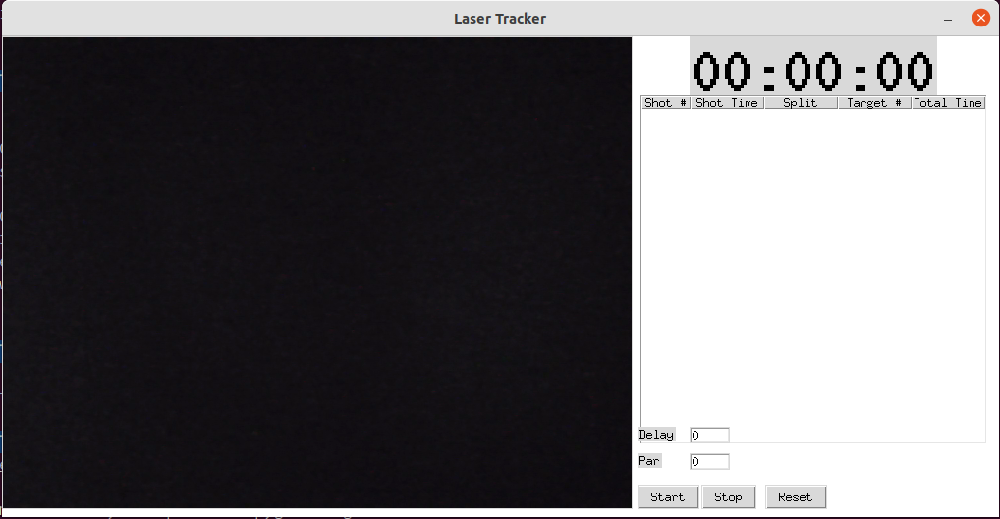

# Laser Shots

This is a laser shot detection + shot timer concept application.  

Use the mouse to draw the target regions on the screen.  Pressing `t` will delete the targets in order of most recent first.  

The application should log hits with a red dot and misses with a black one.  The timer function shows the timing of the shots, and the duration between.

## Dependencies

```
sudo apt install python3-tk
pip3 install opencv-python pygame tk
```

## Screenshots


